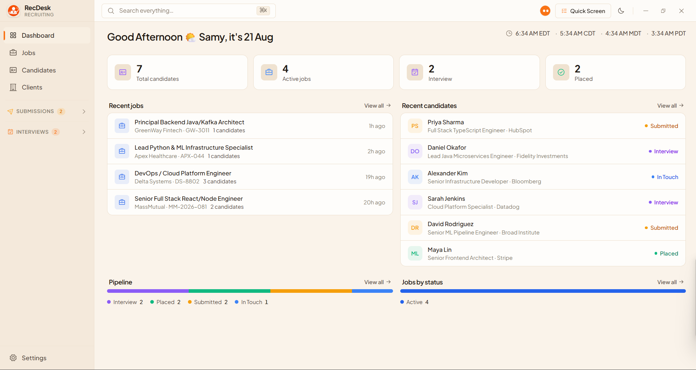
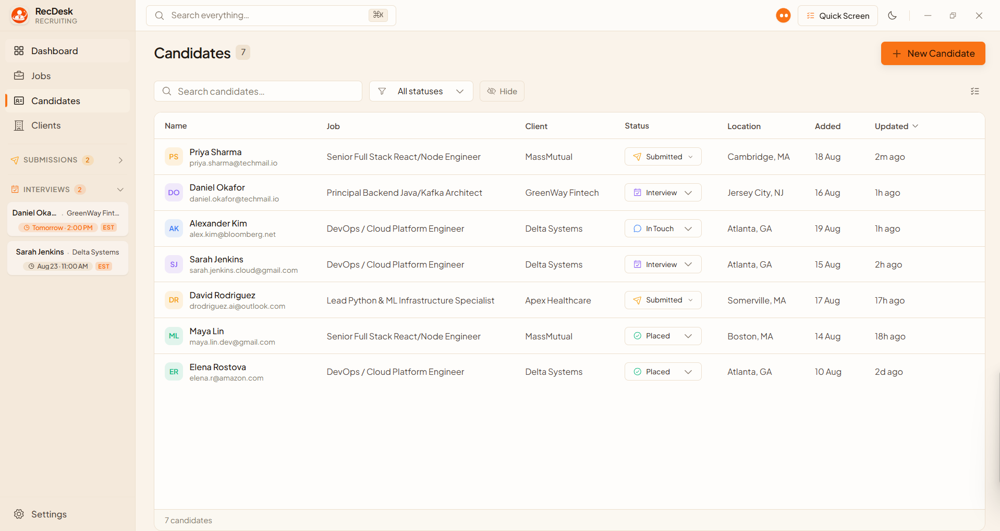
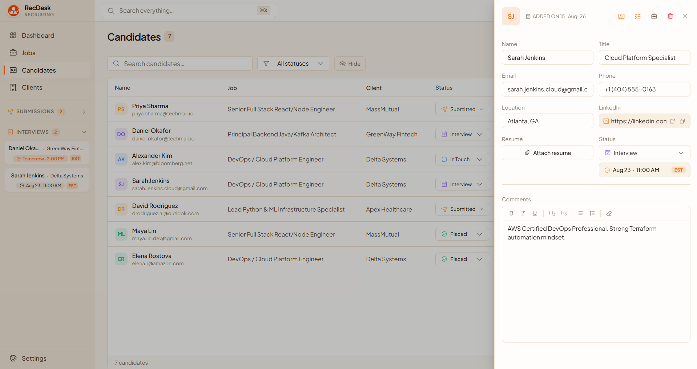
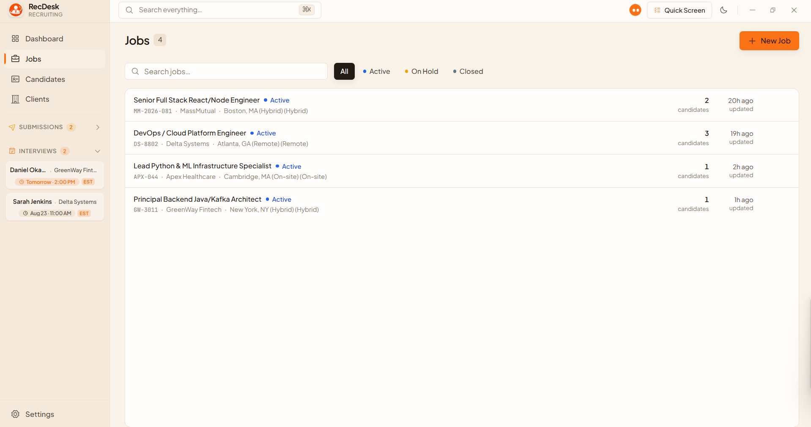
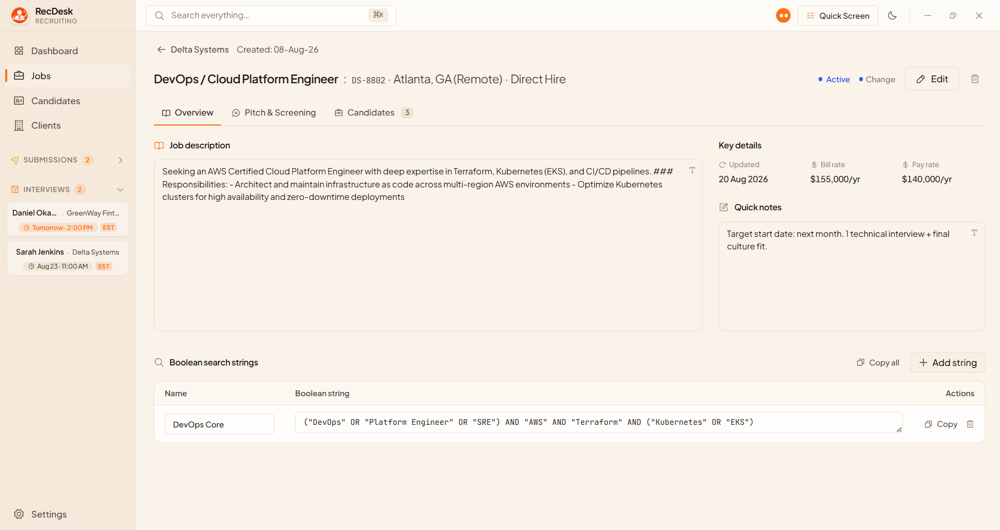
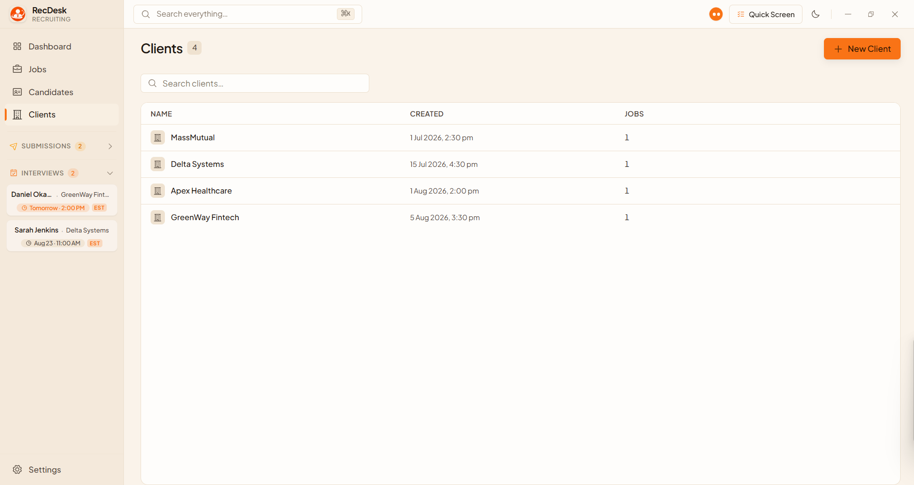
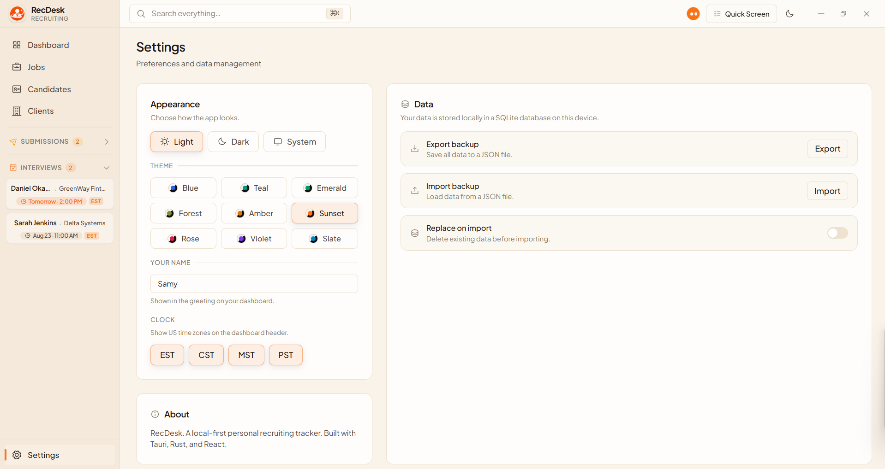

<p align="center">
  
</p>

<h1 align="center">RecDesk</h1>

<p align="center">
  <strong>Fast, Local-First Desktop Command Center for Technical & Agency Recruiters</strong>
</p>

<p align="center">
  
  
  
  
  
</p>

---

## 🚀 What is RecDesk?

**RecDesk** is a **fast, local-first desktop command center and candidate management workspace** designed specifically for technical recruiters, headhunters, sourcers, and agency talent acquisition specialists.

Unlike traditional cloud ATS (Applicant Tracking Systems) that are often slow, bloated, complex, and tied to expensive recurring monthly subscriptions, RecDesk is built for **speed, simplicity, complete data ownership, and automated client submission formatting**. It lives directly on your computer with a high-performance native desktop architecture (built on **Tauri v2 + Rust + SQLite** on the backend and **React 19 + TypeScript + Tailwind CSS** on the frontend).

---

## 🤖 RecDesk Formatter & Cognitive AI Engine

RecDesk features an intelligent **Resume Formatter & Cognitive Engine** that transforms raw PDF/Word candidate resumes into clean, standardized client submissions in seconds.

### 🌟 Key AI & Formatting Capabilities:
- **🧠 Cognitive Block-ID Indexing**: Rather than letting an LLM hallucinate or summarize, RecDesk breaks the document into integer-indexed text blocks. The AI maps block coordinates into structured sections, guaranteeing **100% verbatim text retention** with zero lost bullet points.
- **🛡️ Automated PII Stripping**: Automatically detects and redacts personal contact information (emails, phone numbers, personal addresses, LinkedIn URLs, GitHub links) to protect candidate privacy and agency ownership.
- **⚡ Dual AI Engine Support**:
  - **Local On-Device Models**: Run Qwen 2.5 (0.5B, 1.5B, 3B) locally and offline with zero cloud dependency and 0% background idle CPU.
  - **OpenRouter Cloud Engine**: Multi-key rotation and automatic 429 rate-limit fallback across free models (`llama-3.3-70b`, `gemini-2.0-flash-exp`, `qwen-2.5-72b`, `mistral-small-24b`).
- **📄 Word "Narrow" Margins (0.5 in / 720 dxa)**: Pre-calibrated 0.5-inch page margins with right-aligned tab stops for dates and locations.
- **📐 Universal Client Submission Layout**:
  - `CANDIDATE NAME`: Centered, 11pt Bold, Times New Roman.
  - `PROFESSIONAL SUMMARY:`: 11pt Bold with sentence-level bullet points (`• `).
  - `SKILLS:`: 11pt Bold with inline category grouping (**Category:** item1, item2...).
  - `EDUCATION & CREDENTIALS:`: 11pt Bold with split Institution/Dates header and bulleted awards/medals.
  - `WORK EXPERIENCE:`: 11pt Bold with 10pt Bold Company/Role headers, generous blank line enter spacing between projects, and verbatim accomplishment bullets.
- **✏️ Live Side-by-Side Comparison & WYSIWYG Editing**: TipTap rich text editing ribbon with instant preview, zoom controls (60%–150%), and 1-click `.docx` download.

---

## 🎯 The Core Motive & Philosophy

- **⚡ Zero Latency & Blazing Speed**: Everything is stored in a local SQLite database on your machine. Searching candidates, clicking into jobs, and scheduling interviews happens with zero network lag or loading spinners.
- **🔒 100% Data Privacy & Ownership**: Your candidate dossiers, notes, rates, and client contacts never touch a third-party server or get mined for data. Everything is backed up and restorable with 1-click JSON exports.
- **🛠️ Built for Real Recruiter Workflows**: Rather than generic CRM fields, RecDesk has dedicated tools for the exact daily tasks recruiters perform:
  - Live call screening with autosaving Q&A.
  - 1-click client submission formatting with Right-to-Represent (RTR) timestamps.
  - Multi-timezone tracking to prevent scheduling errors.
  - Boolean search string libraries for every role.

---

## 🧭 Key Features & App Showcase

### 1. 📊 Centralized Dashboard & Multi-Timezone Command Center
- **Prioritized Workflow Cards**: High-level metrics in active pipeline order:
  $$\text{Total Candidates} \longrightarrow \text{Active Jobs} \longrightarrow \text{Interviews} \longrightarrow \text{Placed}$$
- **Direct Click-to-Filter**: Clicking any metric card instantly navigates to and pre-filters your pipeline.
- **Live World Clocks**: Configurable timezone bar in the header (EST, CST, MST, PST, GMT, IST) so you always know your hiring manager's and candidate's local time.
- **Recent Pipeline Feeds**: Real-time snapshot of newly added jobs and active candidate stages.

<p align="center">
  
</p>

---

### 2. 👥 Candidate Management & Screening Pipeline
- **Lifecycle Tracking**: Dedicated statuses: `Sourced`, `In Touch`, `Submitted`, `Interview`, `Placed` (with emerald accent), `Not Interested`, and `Rejected`.
- **Minimal "Hide Rejected" Mode**: 1-click toggle to keep your active pipeline clean and distraction-free.
- **Bulk Pipeline Actions**: Multi-select candidates for batch status updates or removals.

<p align="center">
  
</p>

---

### 3. 📋 Candidate Dossier, Notes & Screening Q&A
- **Comprehensive Profile Panel**: Contact info, experience years, current company/title, and 1-click LinkedIn launcher.
- **Resume Attachment Manager**: Attach local PDF/Word resumes and open them instantly from the app.
- **Status Change Dialogs**: Dedicated popovers for submission tagging (Internal/External), interview scheduling with timezones, and placed date tracking.

<p align="center">
  
</p>

---

### 4. 💼 Job & Requisition Cockpit
- **Role Details**: Work model (Remote, Hybrid, On-site), engagement types (W2, C2C, Contract-to-Hire, Direct Hire), bill rates, pay rates, and active candidate counts.
- **Requisition Filters**: Instant search and status filtering across active and archived requisitions.

<p align="center">
  
</p>

---

### 5. 🔍 Requisition Workspace & Boolean Search Builder
- **Three-Tab Requisition Workspace**:
  1. **Overview**: Refined job description and recruiter internal notes.
  2. **Pitch & Screening**:
     - *Candidate Pitch*: Pre-written elevator pitch ready to read or message.
     - *Screening Questions*: Role-specific qualifying questions.
     - *Boolean Strings*: Built-in library of Tight, Normal, and Broad search strings.
  3. **Candidates Tab**: View all candidates associated with that specific requisition.

<p align="center">
  
</p>

---

### 6. 🏢 Client & Account Directory
- Store client company details, hiring manager contacts, direct phone/email, address, and recruiter account notes.
- Instant overview of active open requisitions and total candidate count per client.
- Custom drag-and-drop sort ordering.

<p align="center">
  
</p>

---

### 7. 🎨 Customization, Theming & Data Portability
- **Theming System**: Light Mode, Dark Mode, System Match with 9 curated color palettes (*Blue, Teal, Emerald, Forest, Amber, Sunset, Rose, Violet, Slate*).
- **Timezone Customization**: Enable/disable world clocks matching your territory coverage.
- **Backup & Restore**: 1-click full JSON backup export and import for instant machine migration.

<p align="center">
  
</p>

---

## ⚡ Specialized Recruiting Superpowers

- **📞 Quick Live Screening (`⌘K` / Header Button)**: Start a candidate phone screen in 1-click without creating a full profile first. Features an interactive Q&A interface with real-time autosave and a **"Copy Q&A Summary"** button to paste directly into client emails.
- **📑 Submission Details & RTR Generator**: Candidate submission dossier tracking RTR timestamp, work authorization, last 4 of SIN/SSN, rate/salary expectations, and background check consent with a 1-click **"Copy Formatted Submission"** button.
- **🗓️ Sidebar Interview & Submission Trackers**:
  - **Upcoming Submissions**: Collapsible list of submitted candidates with internal/external badge indicators.
  - **Upcoming Interviews**: Relative time cards (*Today*, *Tomorrow*, formatted time, timezone badge) with auto-fit zero-scroll design.
- **🔎 Global Fuzzy Search (`⌘K` / `Ctrl+K`)**: Instant keyboard-first search across all clients, jobs, and candidates simultaneously.

---

## 📌 Current State of the App

| Aspect | Current Status |
| :--- | :--- |
| **Version** | `v0.1.2` (Latest Release) |
| **Installers** | Windows Setup (`.exe`), Windows Installer (`.msi`), Standalone Binary |
| **Database** | Embedded SQLite (WAL mode, foreign-key integrity, ACID compliant) |
| **Health & Stability** | 100% Rust backend test pass rate + strict TypeScript compilation |
| **Performance** | Native desktop execution, sub-second startup, zero cloud latency |

---

## 💻 Technical Architecture & Development

RecDesk is built as a native desktop application using [Tauri v2](https://tauri.app/).

### Tech Stack

| Layer | Technology |
| :--- | :--- |
| **Shell & Native Backend** | Tauri v2, Rust |
| **Database & Storage** | Embedded SQLite (via `rusqlite` with WAL mode) |
| **Frontend Framework** | React 19, TypeScript, Vite, Tailwind CSS |
| **State Management** | TanStack Query (React Query), Zustand |
| **Icons & UI** | Phosphor Icons, Radix UI primitives |

### Local Development

```bash
# 1. Install dependencies
pnpm install

# 2. Run in development mode
pnpm tauri dev

# 3. Run backend unit tests
cargo test --manifest-path src-tauri/Cargo.toml

# 4. Build production installer
pnpm tauri build
```

---

## 📄 License

Private project. All rights reserved.