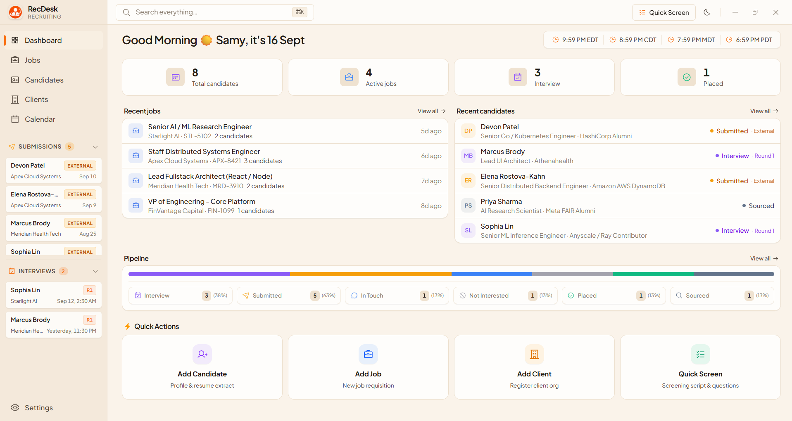
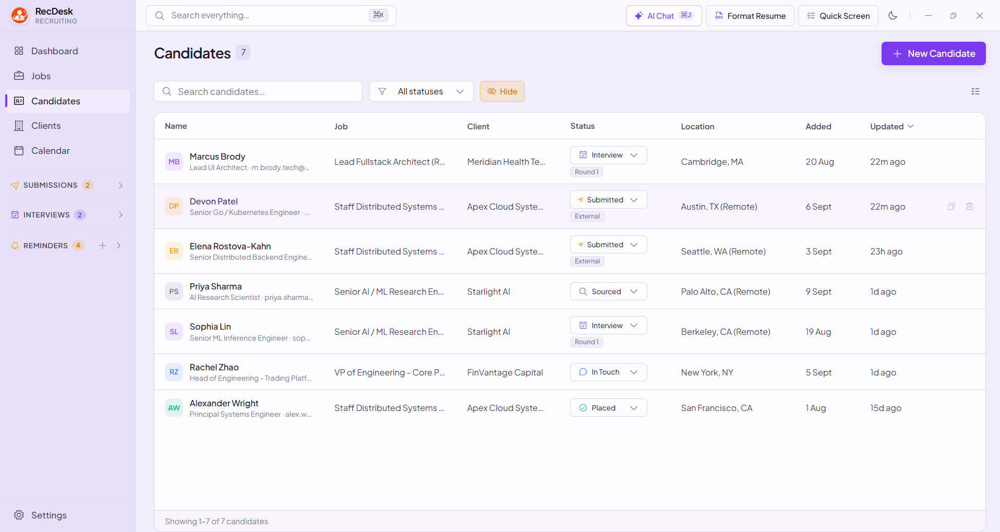
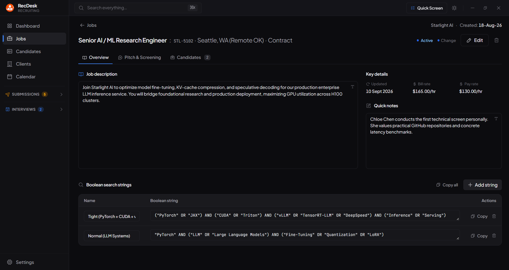
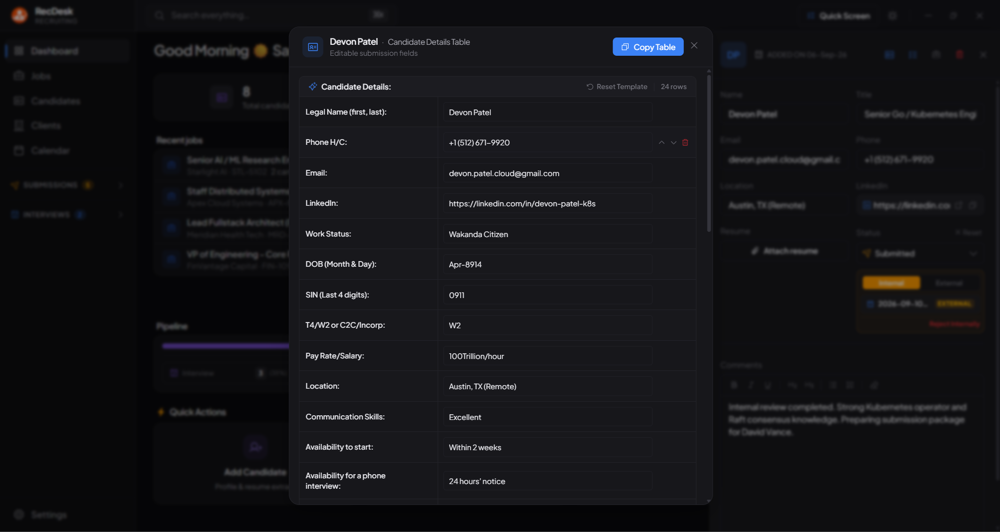
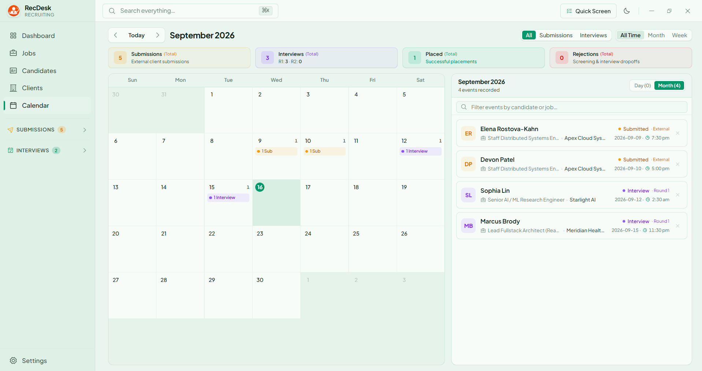
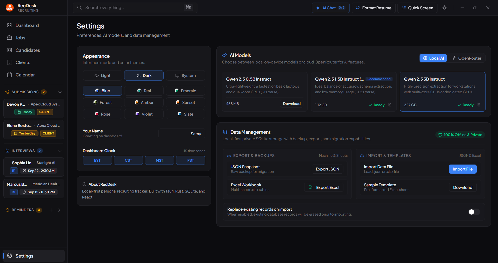

  

<h1 align="center">RecDesk</h1>

  <strong>The fast, local-first desktop command center built to keep your entire recruitment workflow organized in one place.</strong>

  
  
  
  
  

  <a href="#-organized-in-one-place">Core Workflow</a> •
  <a href="#-the-headline-features">Features</a> •
  <a href="#-why-recdesk">Why RecDesk</a> •
  <a href="#-quick-download--install">Download</a>

  

---

## 🎯 Organized in One Place

Recruiting moves fast, but most recruiters spend their days scattered across 15 open browser tabs, messy desktop folders, disconnected spreadsheets, and clunky cloud ATS tools that take seconds to load every click.

**RecDesk brings your entire recruiting desk into a single, lightning-fast native desktop application:**

- **Candidates, Jobs & Clients**: Linked together seamlessly with zero network latency.
- **Milestone & Interview Tracking**: Accurate tracking of internal vs. external submissions, multi-round interviews (R1/R2/R3/Final), and placements with automatic multi-timezone support.
- **Phone Screens & Submissions**: Auto-saving questionnaires and 1-click email summary formatting.
- **Candidate Document Inspection**: In-app PDF and Word resume inspection with zooming, printing, and Word-like inline editing.
- **Total Privacy & Ownership**: Everything lives in a local database directly on your computer — no monthly seat fees, no cloud tracking.

---

## 🌟 The Headline Features

### 1. 📊 Centralized Dashboard & Daily Pipeline Cockpit
See your entire recruiting desk at a single glance the moment you open the app.

- **Real-Time Funnel Counters**: Track active progress across **Total Candidates → Active Requisitions → Scheduled Interviews → Placed Talent**.
- **1-Click Drilldown**: Click any metric card to instantly filter your candidates or jobs.
- **Live World Clocks**: Dedicated timezone bar in the header keeping track of EDT, CDT, MDT, and PDT so you never schedule calls at the wrong time.
- **Recent Activity Streams**: Immediate visibility into newly added requisitions, active candidate stages, and today's scheduled interviews.

---

### 2. 👥 Complete Candidate Lifecycle & Smart Job Management
Organize talent through every milestone: `Sourced`, `In Touch`, `Submitted`, `Interview`, `Placed`, and `Archived`.

- **Move vs. Copy Roles**: Effortlessly transfer a candidate to another requisition, or clone their profile across multiple client searches without duplicating resume files on disk.
- **Safety Confirmation Guards**: Built-in safeguards protect against accidental stage resets or backward pipeline transitions while preserving historical milestones.
- **Duplicate Warnings**: Real-time `ALREADY IN ROLE` badges prevent accidental double submissions.
- **In-Place Detail Drawer**: Review dossiers, notes, resumes, and Right-to-Represent (RTR) details directly from the dashboard without losing your place.

  

---

### 3. 💼 Requisition Cockpit & Boolean Search Builder
Keep every open job organized with dedicated spaces for bill rates, pay margins, candidate pitch scripts, and talent pools.

- **Boolean String Generator**: Instant access to **Tight**, **Normal**, and **Broad** search strings pre-formatted for LinkedIn Recruiter, Indeed, and Google X-Ray searches.
- **Candidate Pitch Scripts**: Keep pre-written elevator pitches right inside the job workspace ready to read during cold calls or outreach.
- **Dedicated Role Candidate Pools**: Filter and review every candidate associated with that specific requisition in one click.

  

---

### 4. 🏢 Client & Account Directory
Manage client companies, account managers, and hiring manager contacts in a clean, structured rolodex.

- **Direct Contacts**: Store hiring manager emails, phone numbers, office locations, and billing notes.
- **Live Headcount Counters**: Instant visibility into total open requisitions and active submissions per client account.
- **Custom Prioritization**: Drag-and-drop client ordering to keep your primary accounts right at the top.

---

### 5. 📋 Candidate Submission Dossiers & Phone Screening
Prepare candidate profiles for client presentations and conduct structured phone screens without fumbling between documents.

- **Editable Submission Fields Table**: Maintain client-facing dossiers covering Legal Name, Work Authorization, Hourly/Salary Expectations, Relocation/Notice period, and Communication rating.
- **1-Click Table Copy**: Hit **Copy Table** to instantly generate an email-ready clipboard format formatted for submission emails.
- **Fast Screen Launcher (`Ctrl+K`)**: Open a candidate screening screen in 1 click from anywhere in the app.
- **Auto-Saving Questions**: Role-specific questionnaires save your call notes as you type so nothing gets lost.

  

---

### 6. 📅 Interactive Recruitment Calendar & Interview Tracking
Keep daily submissions, multi-round interviews, and talent placements synchronized on a single interactive desk calendar.

- **Full Month & Day Matrices**: Track external submissions, round 1/2/3 interviews, and placements on a color-coded calendar grid with a real-time current time indicator.
- **Live Event Feed & Quick Filtering**: Instant access to candidate names, client accounts, interview times, round statuses, and meeting links with 1-click filtering.
- **Persistent Milestone Integrity**: Retains external submission and interview credits even if candidates later face client rejections or advance to offers.
- **Multi-Timezone Conversion**: Automatically reconciles candidate and client timezones against your local machine.

  

---

### 7. 📄 In-App Document Inspection & Resume Editor
Preview candidate resumes and documents instantly without leaving your desk or opening external software.

- **Universal Document Support**: Native rendering for PDF, Microsoft Word (`.docx`), and plain text resumes.
- **Inspection Controls**: Multi-page navigation, smooth zoom (50%–250%), native printing, and external system launch.
- **Inline Document Editor**: Edit candidate resumes directly in the Word-like WYSIWYG editor with live formatting and instant `.docx` saving.

---

### 8. 🔍 Global Instant Search & Keyboard Shortcuts
Navigate across your entire database in milliseconds without taking your hands off the keyboard.

- **Universal Search (`⌘K` / `Ctrl+K`)**: Instantly look up candidates, open requisitions, and client accounts from any screen.
- **Keyboard-Driven Workflow**: Fast shortcuts for quick candidate screening, job creation (`Ctrl+N`), theme toggles, and status updates.
- **In-Place Drawer Navigation**: Jump straight to candidate profiles, dossiers, or job requisitions without losing context or refreshing pages.

---

### 9. 🎨 Curated Themes, US Timezones & 1-Click Data Portability
Your workspace, tailored to how you work best.

- **Curated Themes**: Choose between crisp Light Mode, deep Dark Mode, or system match, paired with 9 calibrated color palettes (*Blue, Teal, Emerald, Forest, Amber, Sunset, Rose, Violet, Slate*).
- **Customizable World Clocks**: Configure which timezones appear in your header bar (EST, CST, MST, PST) to match your active recruiting territories.
- **100% Data Portability**: 1-click full JSON snapshot export/import and Excel workbook generation makes backing up or migrating to a new laptop painless.

  

---

## ⚡ Why RecDesk?

| Traditional Cloud ATS | RecDesk Desktop |
| :--- | :--- |
| 🗂️ Scattered across browser tabs, spreadsheets & Word docs | 🎯 **Everything organized in one unified desktop workspace** |
| 🐌 Spinning loaders and sluggish network requests | ⚡ **Zero latency** — sub-millisecond local SQLite queries |
| 💸 Expensive recurring monthly seat subscriptions | 💎 **Private & local** — lives entirely on your computer |
| ☁️ Your client notes and candidate data mined in the cloud | 🔒 **100% data privacy** — nothing leaves your machine |
| 📄 20 minutes spent hunting for misplaced resume files | 🔍 **Instant in-app preview** for PDF and Word resumes |
| 🌐 Mental timezone math before scheduling calls | ⏰ **Automatic multi-timezone conversion** (EDT/CDT/MDT/PDT) |

---

## 📦 Quick Download & Install

Download the latest version from [GitHub Releases](https://github.com/Samyk000/RecDesk/releases/latest):

- **Standard Windows Setup**: `RecDesk_0.1.4_x64-setup.exe` (Recommended installer)
- **Enterprise MSI Package**: `RecDesk_0.1.4_x64_en-US.msi`
- **Portable Binary**: `recdesk.exe` (Standalone, no installation required)

> Compatible with **Windows 10** and **Windows 11** (64-bit).

---

## 🛠️ Tech Architecture

Built with a modern, high-performance desktop foundation:

- **Core & Native Shell**: [Tauri v2](https://tauri.app/) + [Rust](https://www.rust-lang.org/)
- **Local Storage Engine**: Embedded [SQLite](https://www.sqlite.org/) (WAL mode with memory caching)
- **User Interface**: [React 19](https://react.dev/), [TypeScript](https://www.typescriptlang.org/), [Tailwind CSS](https://tailwindcss.com/)
- **Document Engine**: Custom TipTap WYSIWYG editor & `docx` generation pipeline

---

## 📄 License

Private project. Built with precision for modern recruiters.